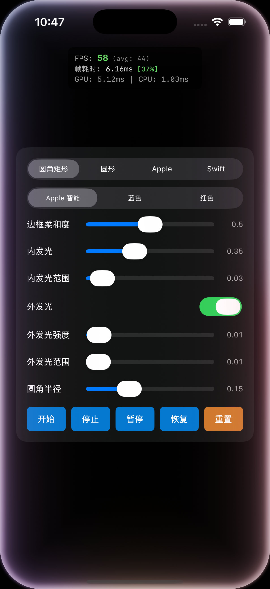
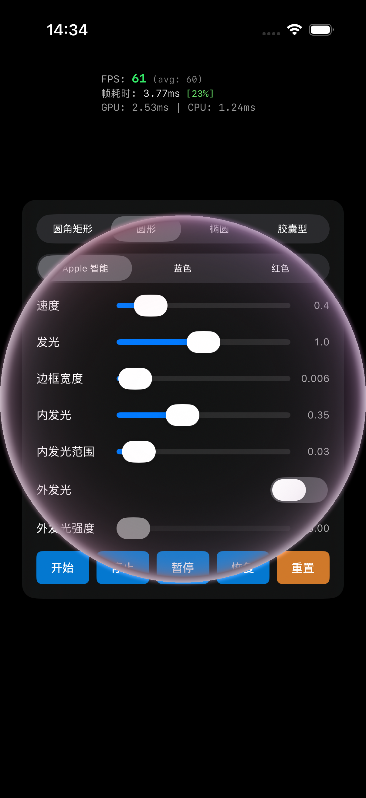
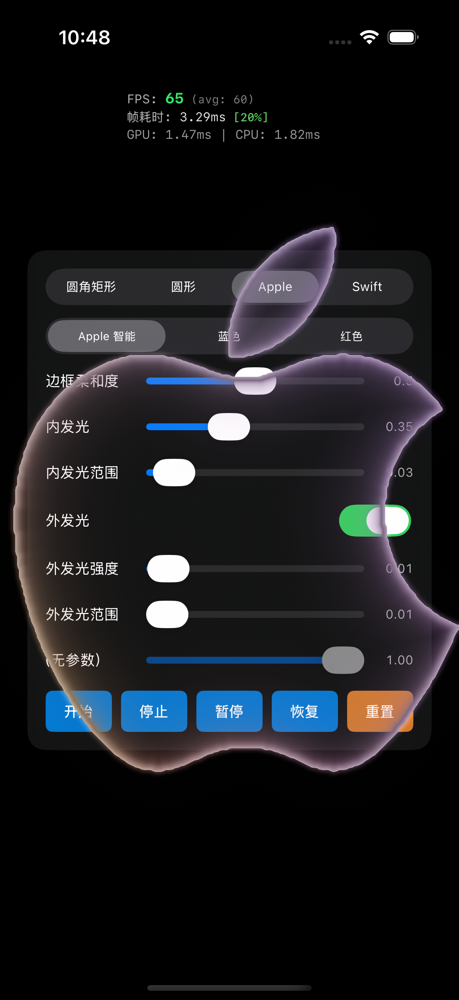
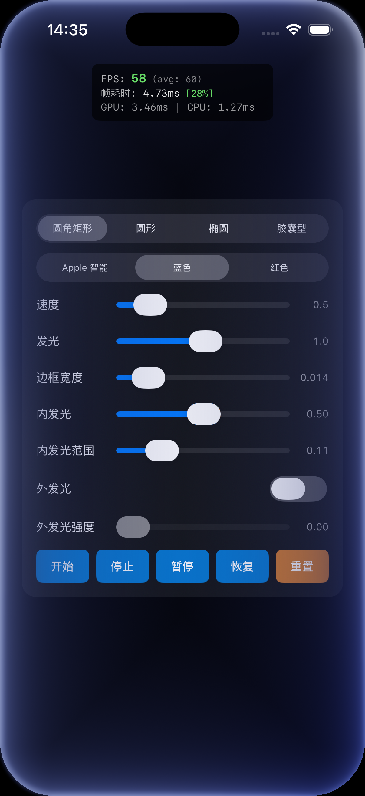
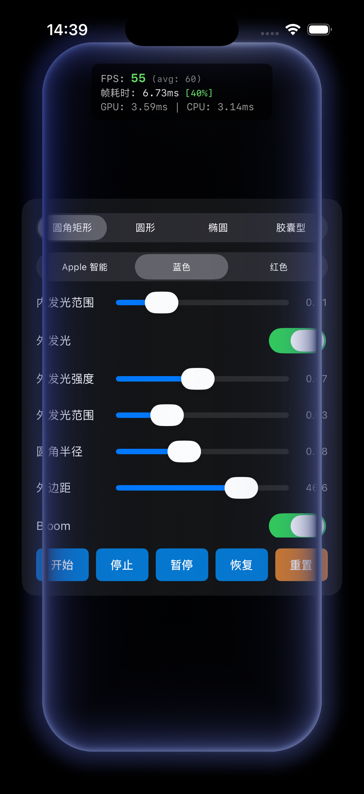

# EnergyShape

Apple Intelligence 风格的边缘发光动画组件 - 在任意形状边缘渲染高质感的能量流动效果。


## 📸 效果预览

<p align="center">
  
  
  
  
  
</p>

## ✨ 特性

- 🎨 **任意形状支持** - 圆角矩形、圆形、椭圆、胶囊型，或任意 CGPath
- ⚡️ **高性能 Metal 渲染** - 60fps 流畅动画，支持 4x MSAA 抗锯齿
- 🌈 **IDW 颜色融合** - 反距离加权插值实现自然渐变
- ✨ **多层发光效果** - 边框、内发光、外发光独立可控
- 🔥 **Bloom 辉光后处理** - 4-Pass 高质量 Bloom
- 📐 **解析形状 SDF** - 无纹理采样的精确距离场计算
- 🔄 **状态机动画** - idle → startup → loop ⇄ settle
- 📊 **实时性能监控** - FPS、帧耗时、帧预算使用百分比

## 📦 安装

### Swift Package Manager

```swift
dependencies: [
    .package(url: "https://github.com/HapticTide/EnergyShape.git", from: "1.0.0")
]
```

### 本地引用

在 Xcode 项目中：
1. File → Add Package Dependencies
2. 选择 "Add Local..."
3. 选择 EnergyShape 目录

## 🚀 快速开始

```swift
import EnergyShape

// 创建能量视图
let energyView = EnergyShapeView(frame: view.bounds)
energyView.msaaEnabled = true  // 开启 4x MSAA

// 使用解析形状（推荐，无需生成 SDF 纹理）
energyView.analyticShapeOverride = .roundedRect(cornerRadius: 0.15)

// 使用预设配置
energyView.config = ColorPresets.appleIntelligenceConfig

// 添加到视图并开始
view.addSubview(energyView)
energyView.start()
```

### 自定义颜色

```swift
var config = EnergyConfig()
config.colorStops = [
    ColorStop(position: 0.0, color: .systemBlue),
    ColorStop(position: 0.33, color: .systemPurple),
    ColorStop(position: 0.66, color: .systemPink),
    ColorStop(position: 1.0, color: .systemOrange)
]
energyView.config = config
```

## ⚙️ 配置参数

### 基础参数

| 参数 | 类型 | 范围 | 默认值 | 说明 |
|------|------|------|--------|------|
| `speed` | Float | 0.1~3.0 | 0.5 | 流动速度 |
| `glowIntensity` | Float | 0~2.0 | 1.2 | 整体发光强度 |

### 边框发光

| 参数 | 类型 | 范围 | 默认值 | 说明 |
|------|------|------|--------|------|
| `borderWidth` | Float | 0.005~0.08 | 0.018 | 边框宽度（归一化） |
| `innerGlowIntensity` | Float | 0~1.0 | 0.45 | 内发光强度 |
| `innerGlowRange` | Float | 0.01~0.5 | 0.2 | 内发光范围 |
| `outerGlowIntensity` | Float | 0~1.0 | 0.0 | 外发光强度 |
| `outerGlowRange` | Float | 0.01~0.1 | 0.03 | 外发光范围 |

### Bloom 后处理

| 参数 | 类型 | 范围 | 默认值 | 说明 |
|------|------|------|--------|------|
| `bloomEnabled` | Bool | - | true | 启用 Bloom |
| `bloomIntensity` | Float | 0~1.0 | 0.6 | Bloom 强度 |
| `bloomThreshold` | Float | 0~1.0 | 0.6 | Bloom 阈值 |

## 🎨 颜色预设

```swift
// Apple Intelligence 彩虹渐变（默认）
energyView.config = ColorPresets.appleIntelligenceConfig

// 纯蓝色渐变
energyView.config = ColorPresets.blueConfig

// 纯红色渐变
energyView.config = ColorPresets.redConfig
```

## 📐 解析形状

使用解析形状可以避免 SDF 纹理生成，性能更优：

```swift
// 圆角矩形
energyView.analyticShapeOverride = .roundedRect(cornerRadius: 0.15)

// 圆形
energyView.analyticShapeOverride = .circle(radius: 0.45)

// 椭圆
energyView.analyticShapeOverride = .ellipse(radiusX: 0.45, radiusY: 0.3)

// 胶囊
energyView.analyticShapeOverride = .capsule(radiusX: 0.45, radiusY: 0.12)
```

## 📊 性能监控

```swift
energyView.delegate = self

// 实现代理方法
func energyShapeView(_ view: EnergyShapeView, didUpdateStats stats: EnergyPerformanceStats) {
    print("FPS: \(stats.currentFPS)")
    print("帧耗时: \(stats.totalFrameTime)ms")
    print("帧预算使用: \(stats.frameBudgetUsage)%")
    print("性能等级: \(stats.performanceGrade.rawValue)")
}
```

## 📁 项目结构

```
EnergyShape/
├── Package.swift
├── Sources/EnergyShape/
│   ├── EnergyConfig.swift        # 配置参数与性能统计
│   ├── EnergyShapeView.swift     # 公开 API
│   ├── EnergyMetalRenderer.swift # Metal 渲染器
│   ├── EnergyMaskCache.swift     # Mask/SDF 缓存
│   ├── EnergyStateMachine.swift  # 状态机
│   ├── TexturePool.swift         # 纹理复用池
│   └── Shaders.metal             # GPU 着色器
├── Demo/
│   └── EnergyShapeDemo/          # 演示应用
└── Tests/
```

## 🔧 技术实现

### 渲染管线
1. **解析 SDF** - 直接在着色器中计算形状距离场
2. **IDW 颜色混合** - 反距离加权插值颜色控制点
3. **多层发光** - 边框 + 内发光 + 外发光叠加
4. **Bloom 后处理** - 阈值提取 → 高斯模糊 → 合成

### 抗锯齿
- **软件 AA** - `fwidth()` 2.5 像素过渡带
- **硬件 MSAA** - 可选 4x 多重采样

### 外发光颜色一致性
外发光颜色通过边缘投影算法，从内部 IDW 渐变中采样，确保颜色连续性。

## 📱 系统要求

- iOS 14.0+
- Swift 5.9+
- 支持 Metal 的设备

## 📄 License

MIT License
